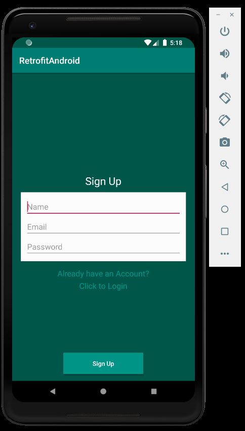
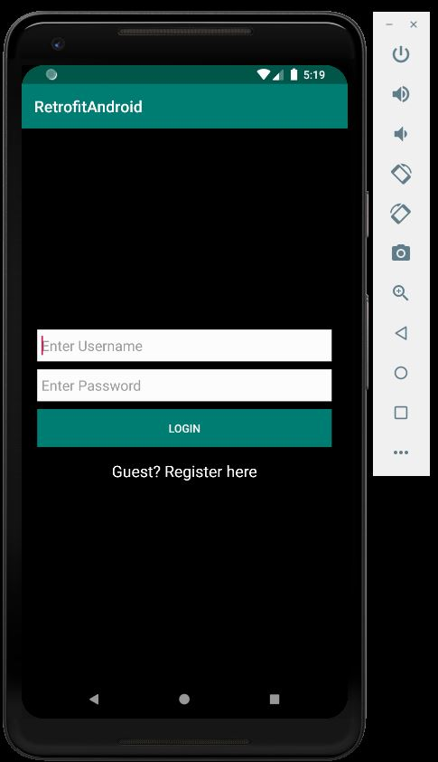

# LogInSignUp-using-Retrofit

Login and SignUp form for Android using Retrofit2 library.

Data are stored in MySQL database.

PHP files are used to store and retrieve the data in the database table.

      
